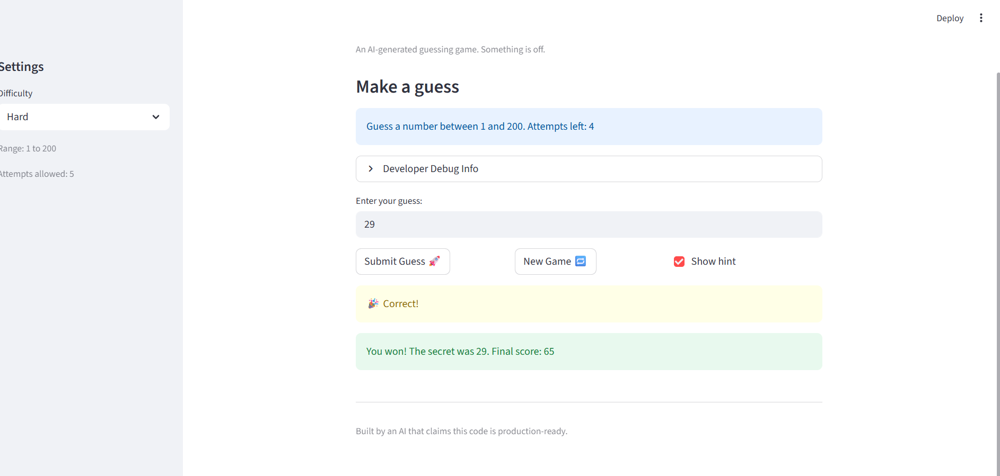

# 🎮 Game Glitch Investigator: The Impossible Guesser

## 🚨 The Situation

You asked an AI to build a simple "Number Guessing Game" using Streamlit.
It wrote the code, ran away, and now the game is unplayable. 

- You can't win.
- The hints lie to you.
- The secret number seems to have commitment issues.

## 🛠️ Setup

1. Install dependencies: `pip install -r requirements.txt`
2. Run the broken app: `python -m streamlit run app.py`

## 🕵️‍♂️ Your Mission

1. **Play the game.** Open the "Developer Debug Info" tab in the app to see the secret number. Try to win.
2. **Find the State Bug.** Why does the secret number change every time you click "Submit"? Ask ChatGPT: *"How do I keep a variable from resetting in Streamlit when I click a button?"*
3. **Fix the Logic.** The hints ("Higher/Lower") are wrong. Fix them.
4. **Refactor & Test.** - Move the logic into `logic_utils.py`.
   - Run `pytest` in your terminal.
   - Keep fixing until all tests pass!

## 📝 Document Your Experience

- [ ] Describe the game's purpose.
The game's purpose is to guess a random generated number between a range that is given to the user based on the difficulty level they choose. For that you have a certain number of attempts, and after each guess, you get a hint if your guess is too high or too low. The game also has a scoring system that rewards you for guessing the number in fewer attempts.

- [ ] Detail which bugs you found.
The game was giving me wrong hints, the "hard" mode was easier than normal mode, the "easy" mode had fewer attempts than normal mode, the game ignored difficulty level and always gave the same number of attempts. And finally, the game didn't prevent me from entering invalid inputs such as an out of range number.

- [ ] Explain what fixes you applied.
Mapping to the right hint messages, fixed the logic of hard and easy mode, increase the number of attempts for easy mode, and added input validation to prevent invalid inputs.

## 📸 Demo

- [ ] [Insert a screenshot of your fixed, winning game here]

## 🚀 Stretch Features

- [ ] [If you choose to complete Challenge 4, insert a screenshot of your Enhanced Game UI here]
